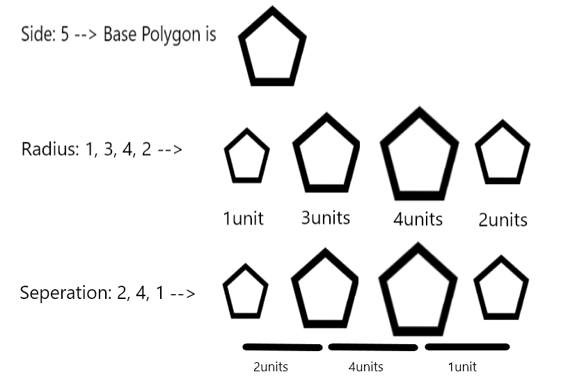

# 3D-ENGINE
---
## **CS PROJECT**
### ***This is a python library which can be used for 3D modelling and rendering***
---
### How To Install
* #### _Make sure pip is installed in your system, else install pip before proceeding(skip for the venv and exe versions)_
* #### _Download the zip file from [Download v1.3.1](https://github.com/Amith225/3D-ENGINE/archive/v1.3.1.zip)(source codeonly) or <br>[Download v1.0-venv](https://github.com/Amith225/3D-ENGINE/archive/v1.0.zip)(with the venv, no dependency)(not recommended)(old version) or <br>[Download v1.3.1-exe](https://github.com/Amith225/3D-ENGINE/archive/v1.3.1-exe.zip)(stand-alone executable)_
* #### _After Installing open cmd inside the 3D-ENGINE folder and run ```pip install -r requirements.txt``` (only for source code version)_
* #### _If using virtual environment(setup by you) run the command through it_
* #### _Finally to see the demo run demo.py in the scr. Use the renderer.py as a library_
---
### Snapshots, About and How To Use
* #### Home Page
  .png)
* #### Load 3D Object File from Examples
  .png)
* #### 3D Object is rendered
  .png)
* #### Check turbulence and/or rotate for movement and/or rotation of the 3D Object
  .png)
* #### Check look through for viewing the behind scene of the 3D Object
  .png)
* #### Check show orient to see the orientation of the 3D Object in three mutually orthogonal axes
  .png)
* #### FOV(field of view) is the angle of view, change it to see how different fov looks like
  .png)
* #### Bring Your Imagination into your screen
  
  - Side is the number of sides your base polygon has for the entire parallelopiped 3D Object.
  - Radius is the different size the base polygon assumes in constructing the 3D Object from bottom to top.
  - Separation is the distance from one base polygon to its successive one.
  - Color can be a common color name or a hex code(eg: '#fff', '#aabc92', '#111222333')
    .png)
* #### Wow, You made Your 3D Object, now it's time to save it
  .png)
  .png)
* #### Play and experiment with the 3D Object and have Fun
  .png)
  .png)
  .png)
* #### That's not it
  - Use UpArrow, DownArrow, LeftArrow, RightArrow key to move the Camera
  - Use 'w', 's', 'a', 'd' keys to rotate the camera in up, down, left, right directions
  - Can't see Your 3D Object clearly, or it's too bright, use 't', '<SHIFT-T>'(shutter sensitivity) or
    'l', '<SHIFT-L>'(light source) or 'c', <SHIFT-C>(clarity) to change lighting

# Hope You Like The App :)
